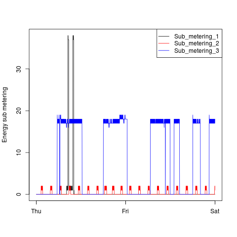
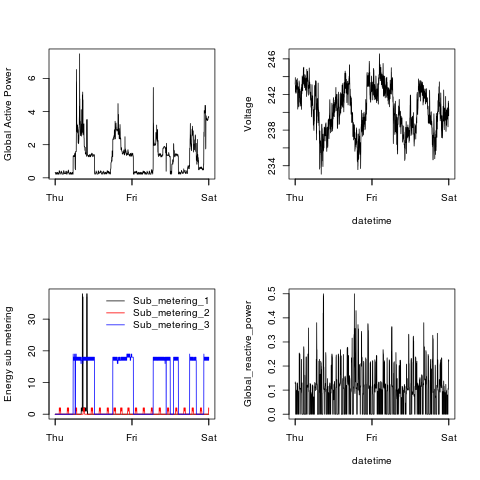

## Ronnys Submission for Project 1
There are a total of 5 R files submitted as part of this assignment, along with 4 PNG images. 

### getData.R
Within this file there is a function called:

    getDataInDateRange()

This function efficiently imports a subset of the data from the text file. It does so by only reading the relevant lines that are associated with the desired date-time range. 

This assignment involved looking at readings from the 1st and 2nd of February 2007. However, with the getDataInDateRange() function, we can easily and efficiently exctract readings from any arbitrary date-time range. This is done by simply feeding the desired start and end datetimes as arguments. 

Example Usage:

    dataFile <- "household_power_consumption.txt"
    
    # The range of datetimes that we are interested in looking at
    startDate <- strptime("2007-02-01 0:0:0", format="%Y-%m-%d %H:%M:%S")
    endDate <- strptime("2007-02-02 23:59:0", format="%Y-%m-%d %H:%M:%S")
    
    getDataInDateRange(datafile, startDate, endDate)

#### What makes it efficient?
It achieves its efficiency by ONLY reading the relevant lines from the source file, instead of reading the whole file into memory, and then filtering. 

It calculates what the relevant lines in the text file are by firstly taking a one line sample of the data. From this sample, it can determine the timestamp of of the very first reading. Once it has established that, it's just a matter of calculating how many minutes must elapse from this initial measurement and the start of the desired range. It also calculates how many minutes there are in the desired range. The number of minutes determines the number of rows that must be skipped and read in the text file. 

### plotN.R
There are 4 R files that are responsible for creating a different plot and saving it as a PNG file. 

* plot1.R
* plot2.R
* plot3.R
* plot4.R

These all import the getData.R file, and make a call to the getDataInDateRange() function to create the desired dataframe. Each makes a separate plot, which is saved as a PNG file.  

### plotN.png
These are samples of the files that are generated after running each of the plotN.R files. 

* plot1.png
* plot2.png
* plot3.png
* plot4.png

#### Ronny's Plot 1
 

#### Ronny's Plot 2
 

#### Ronny's Plot 3
 

#### Ronny's Plot 4
 

## Data Used to generate Plots
This assignment uses data from the 
<a href="http://archive.ics.uci.edu/ml/">UC Irvine Machine Learning 
Repository</a>, a popular repository for machine learning datasets. 
In particular, it uses the 
"Individual household electric power consumption Data Set" which was made available on
the course web site:

* <b>Dataset</b>: <a href="https://d396qusza40orc.cloudfront.net/exdata%2Fdata%2Fhousehold_power_consumption.zip">Electric power consumption</a> [20Mb]

* <b>Description</b>: Measurements of electric power consumption in
one household with a one-minute sampling rate over a period of almost
4 years. Different electrical quantities and some sub-metering values
are available.

The following descriptions of the 9 variables in the dataset are taken
from
the <a href="https://archive.ics.uci.edu/ml/datasets/Individual+household+electric+power+consumption">UCI
web site</a>:

<ol>
<li><b>Date</b>: Date in format dd/mm/yyyy </li>
<li><b>Time</b>: time in format hh:mm:ss </li>
<li><b>Global_active_power</b>: household global minute-averaged active power (in kilowatt) </li>
<li><b>Global_reactive_power</b>: household global minute-averaged reactive power (in kilowatt) </li>
<li><b>Voltage</b>: minute-averaged voltage (in volt) </li>
<li><b>Global_intensity</b>: household global minute-averaged current intensity (in ampere) </li>
<li><b>Sub_metering_1</b>: energy sub-metering No. 1 (in watt-hour of active energy). It corresponds to the kitchen, containing mainly a dishwasher, an oven and a microwave (hot plates are not electric but gas powered). </li>
<li><b>Sub_metering_2</b>: energy sub-metering No. 2 (in watt-hour of active energy). It corresponds to the laundry room, containing a washing-machine, a tumble-drier, a refrigerator and a light. </li>
<li><b>Sub_metering_3</b>: energy sub-metering No. 3 (in watt-hour of active energy). It corresponds to an electric water-heater and an air-conditioner.</li>
</ol>

## Target Plots

Below are the images of the target plots that we were asked to try construct using R code. 

### Plot 1

 

### Plot 2

 

### Plot 3

 

### Plot 4

 

